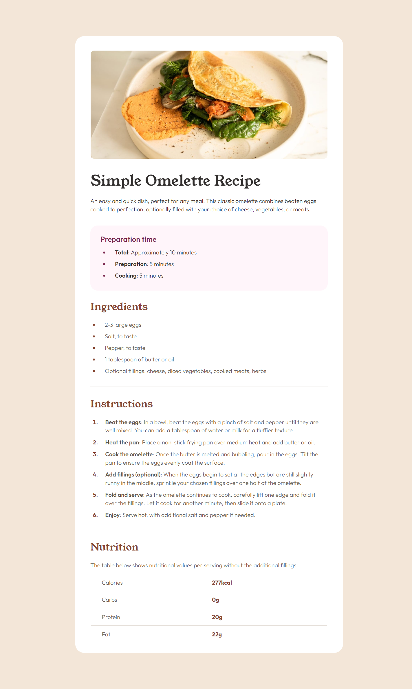
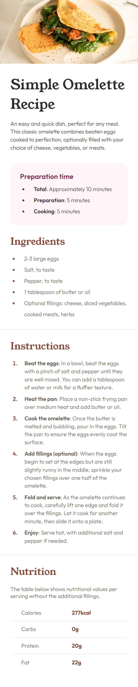

# Frontend Mentor - Blog preview card solution

Esta é uma solução para o [Recipe page challenge on Frontend Mentor](https://www.frontendmentor.io/challenges/recipe-page-KiTsR8QQKm). Os desafios do Frontend Mentor ajudam você a melhorar suas habilidades de codificação através da construção de projetos realistas. 

## Índice

- [Visão geral](#visão-geral)
  - [Screenshot](#screenshot)
  - [Links](#links)
- [Meu processo](#meu-processo)
  - [Construído com](#construído-com)
  - [O que eu aprendi](#o-que-eu-aprendi)
  - [Desenvolvimento contínuo](#desenvolvimento-contínuo)
- [Autor](#autor)

## Visão geral

### Screenshot

Desktop

Mobile


### Links

- Live Site URL: [Recipe page](https://isabela-fernanda.github.io/recipe-page/)

## Meu processo

### Construído com

- Semantic HTML5 markup
- CSS custom properties
- Flexbox
- CSS Grid
- Mobile-first workflow

### O que eu aprendi

Neste projeto eu fixei meus conhecimentos sobre flex, passei a usar rem ao invéz de pixel, usei variáveis para as cores(Código 1) e fiz um estilo exclusivo para mobile(Código 2).

Código 1
```css
:root {
  --Nutmeg: hsl(14, 45%, 36%);
  --Dark-Raspberry: hsl(332, 51%, 32%);
  --White: hsl(0, 0%, 100%);
  --Rose-White: hsl(330, 100%, 98%);
  --Eggshell: hsl(30, 54%, 90%);
  --Light-Grey: hsl(30, 18%, 87%);
  --Wenge-Brown: hsl(30, 10%, 34%);
  --Dark-Charcoal: hsl(24, 5%, 18%);
}
```

Código 2
```css
@media(max-width: 520px){
    article {
        margin: 0px;
        padding-top: 0px;
        padding: 0px;
        border-radius: 0px;
    }

    img {
        width: 100%;
        padding: 0px;
        border-radius: 0px;
    }

    div{
        width: 85%;
        
    }

    div:last-child{
        margin-bottom: 60px;
    }
}
```

### Desenvolvimento contínuo

Planejo continuar focando em projetos de HTML e CSS para praticar e fixar o que aprendi sobre essas linguagens

## Autor

- Frontend Mentor - [@Isabela-Fernanda](https://www.frontendmentor.io/profile/Isabela-Fernanda)